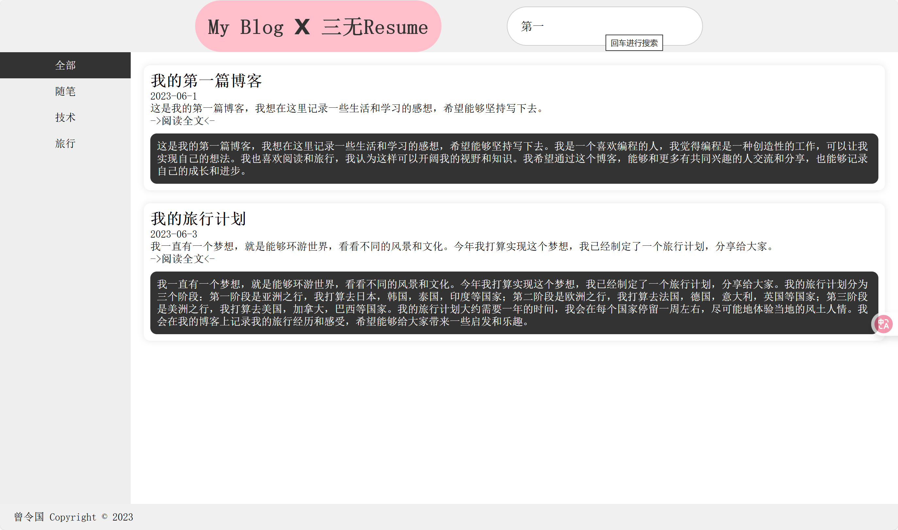
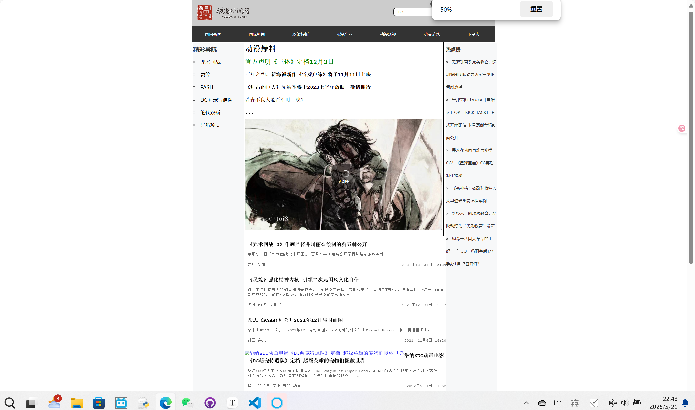
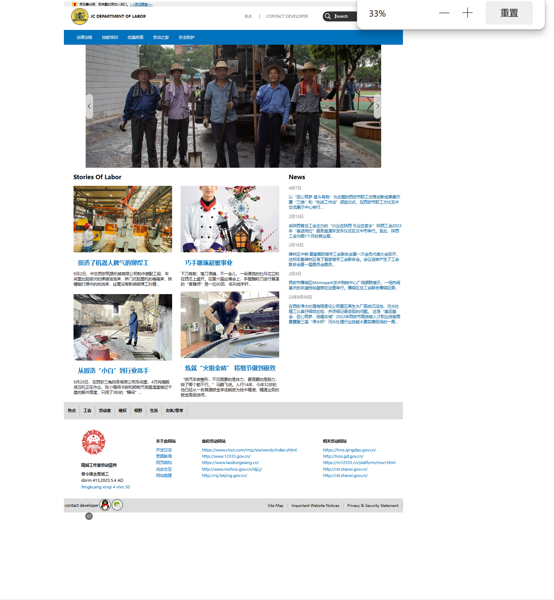
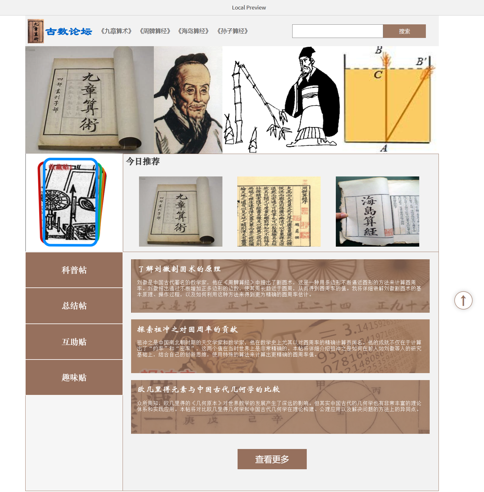
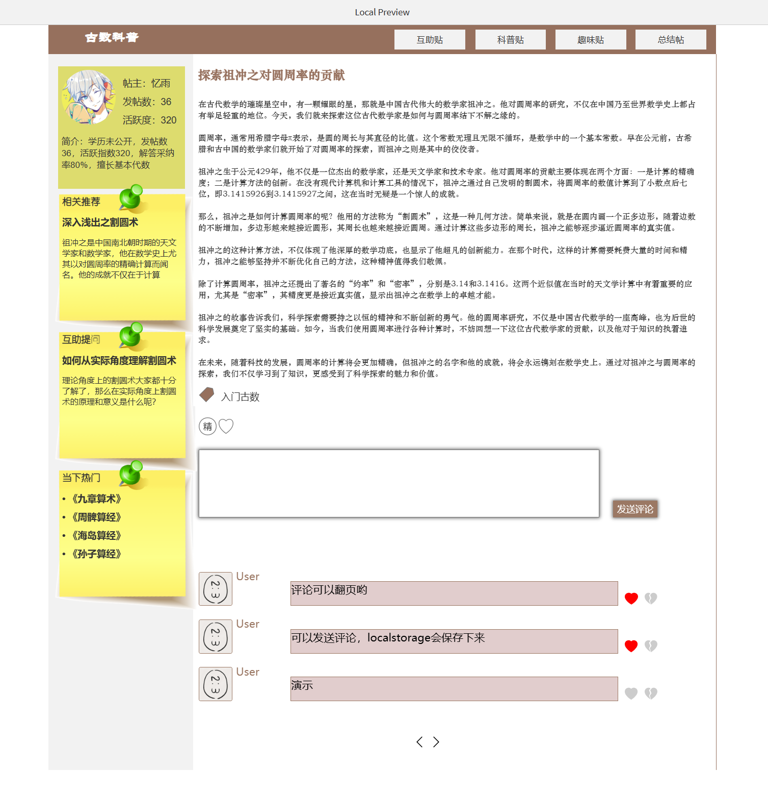
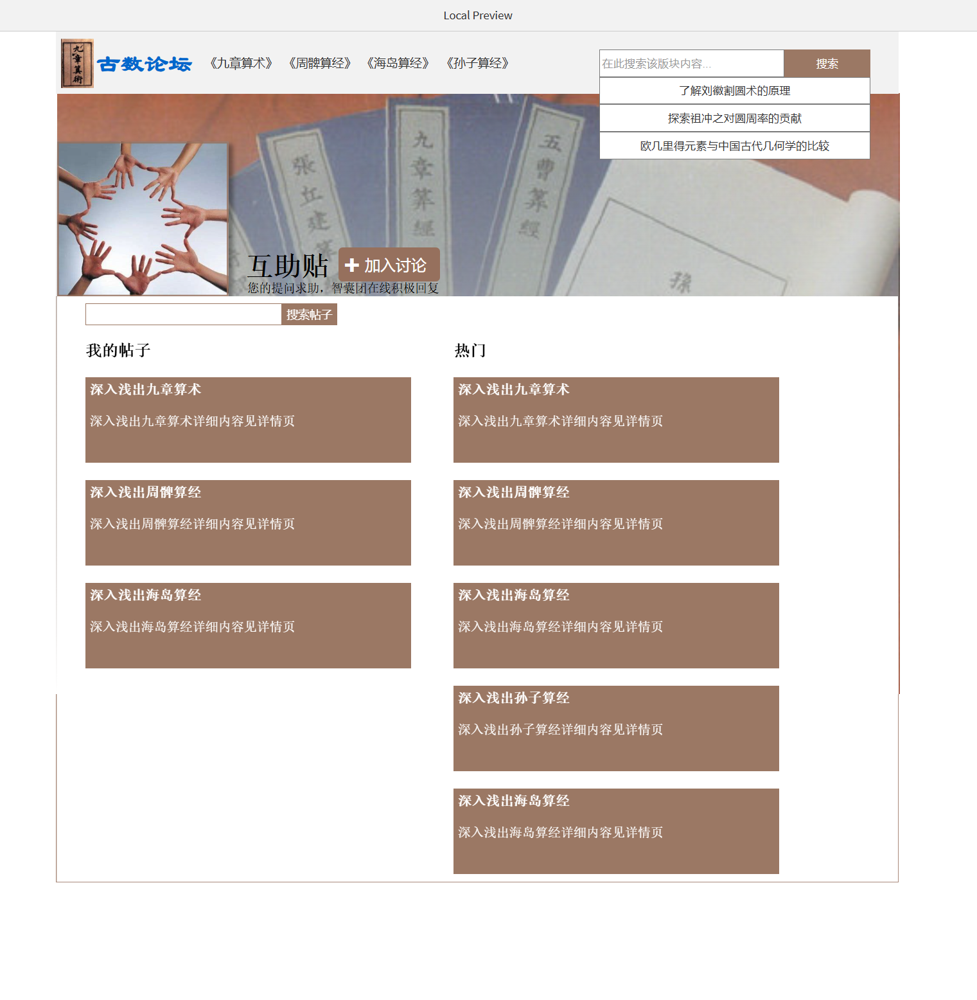
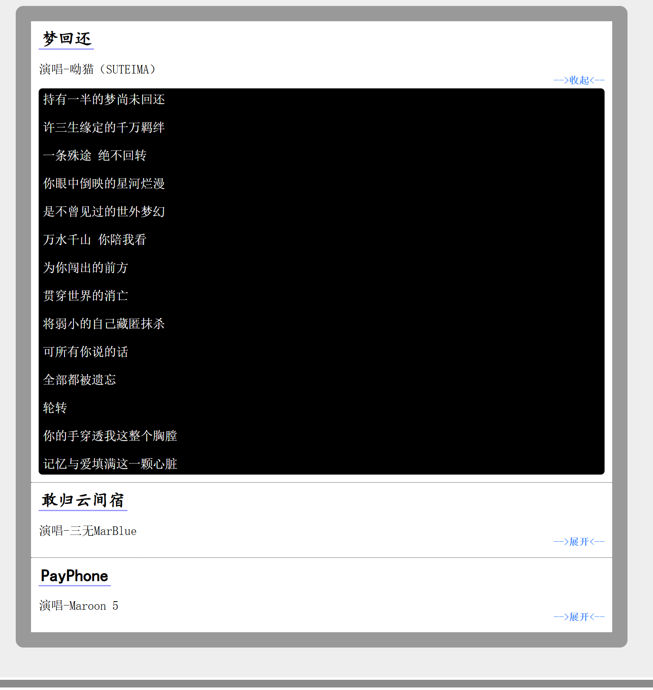
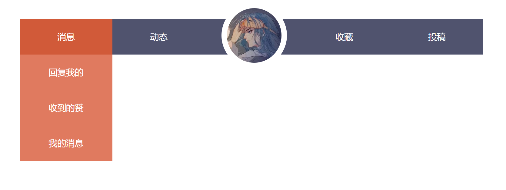

# xiaobai-zeng-cabin

#### 介绍
大一学习web三剑客时做的一些静态页面

#### 使用说明

1. Axure_test

   > 学习**人机界面设计课程**时创作Axure UI**四大瓷都**项目用的一些小模块
   >
   > 演示地址：
   >
   > [row_1](https://slothclient.github.io/AirCyan_Web/Axure_test/row_1)
   >
   > [row_2](https://slothclient.github.io/AirCyan_Web/Axure_test/row_2)
   >
   > [foot_1](https://slothclient.github.io/AirCyan_Web/Axure_test/foot_1)

2. 回到顶部

   > 随手写的博客内容
   >
   > [纯CSS平滑回到顶部](https://slothclient.github.io/AirCyan_Web/回到顶部)

3. account

   > 学习Vue2时随手写的综合性小项目
   >
   > [记账系统（HTML+CSS+Vue2.js）](https://slothclient.github.io/AirCyan_Web/account/account)

4. FormalTasks

   > 个人博客（HTML+CSS+JS）,web前端课程大作业
   >
   > [个人博客](https://slothclient.github.io/AirCyan_Web/FormalTasks/博客_1)
   >
   > 
   >
   > 动漫新闻网，社团的一次作业，基础的网页结构布局
   >
   > [动漫新闻网](https://slothclient.github.io/AirCyan_Web/FormalTasks/网页结构/网页结构)
   >
   > 
   >
   > 劳动节参与社团计算机设计比赛所做（HTML+CSS+Vue2.js）
   >
   > [宣传劳动](https://slothclient.github.io/AirCyan_Web/FormalTasks/宣传劳动/Labor/labor)
   >
   > 
   >
   > 人机界面设计课程Axure项目“古数吾同”相关代码模块
   >
   > [古数吾同项目论坛列表模块](https://slothclient.github.io/AirCyan_Web/forum - 副本/continent)
   >
   > [首页banner swiper-demonstration](https://slothclient.github.io/AirCyan_Web/Axure_test/swiperDemo)
   >
   > [论坛页swiperCards](https://slothclient.github.io/AirCyan_Web/Axure_test/SwiperCards)
   >
   > [古数吾同项目论坛评论区](https://slothclient.github.io/AirCyan_Web/forum - 副本/sendMsg)
   >
   > 
   >
   > 
   >
   > 学习JQuery时做的一些小功能
   >
   > [百叶窗-超好看！！](https://slothclient.github.io/AirCyan_Web/jQuery_practice/百叶窗)
   >
   > <video src="jQuery_practice\videos\shutters.mp4"></video>
   >
   > [轮播0](https://slothclient.github.io/AirCyan_Web/jQuery_practice/轮播)
   >
   > [轮播1](https://slothclient.github.io/AirCyan_Web/jQuery_practice/轮播/test1)
   >
   > [轮播2](https://slothclient.github.io/AirCyan_Web/jQuery_practice/轮播/test2)
   >
   > [闪烁动画](https://slothclient.github.io/AirCyan_Web/jQuery_practice/闪烁动画)
   >
   > [折叠面板](https://slothclient.github.io/AirCyan_Web/jQuery_practice/折叠面板)
   >
   > 
   >
   > 手搓列表的练习
   >
   > [list1-超好看！！](https://slothclient.github.io/AirCyan_Web/List/List_practice_1/formal_list)
   >
   > 
   >
   > [list2-练习](https://slothclient.github.io/AirCyan_Web/List/List_practice_1/lablist)
   >
   > [list3-丝滑](https://slothclient.github.io/AirCyan_Web/List/List_practice_2/list_1/listshell)
   >
   > [list4-练习](https://slothclient.github.io/AirCyan_Web/List/List_practice_2/list_2/listwo)
   >
   > [list5-练习](https://slothclient.github.io/AirCyan_Web/List/List_practice_2/list_3/list_review)
   >
   > 下面是仿朋友圈的
   >
   > [仿朋友圈0](https://slothclient.github.io/AirCyan_Web/Moments)
   >
   > [仿朋友圈1](https://slothclient.github.io/AirCyan_Web/Moments/朋友圈/朋友圈)
   >
   > 下面是仿NASA（现在NASA已经改了，所以会和现在不一样）
   >
   > [仿NASA](https://slothclient.github.io/AirCyan_Web/NASA/nasa_patch)
   >
   > [文档流练习](https://slothclient.github.io/AirCyan_Web/NASA/文档流)
   >
   > 下面是简单的前端简历页面
   >
   > [简历页](https://slothclient.github.io/AirCyan_Web/Resume/resume)
   >
   > 下面是仿paopao玛特布局？不记得了
   >
   > [仿泡泡](https://slothclient.github.io/AirCyan_Web/Shop/shop)
   >
   > 下面是`Vue2.js`练习的小功能
   >
   > [动态面板](https://slothclient.github.io/AirCyan_Web/v-bind动态面板/v-bind动态面板)
   >
   > [轮播图](https://slothclient.github.io/AirCyan_Web/v-bind轮播图/v-bind轮播图)
   >
   > [照片墙](https://slothclient.github.io/AirCyan_Web/v-on照片墙/v-on照片墙)

~~下面是创建时默认的一些没啥用的，之前在gitee，结果用一半pages服务崩了，找客服两周后才说一句服务器原因，果断转到GitHub..~~

#### 参与贡献

1.  Fork 本仓库
2.  新建 Feat_xxx 分支
3.  提交代码
4.  新建 Pull Request

#### 特技

1.  使用 Readme\_XXX.md 来支持不同的语言，例如 Readme\_en.md, Readme\_zh.md
2.  Gitee 官方博客 [blog.gitee.com](https://blog.gitee.com)
3.  你可以 [https://gitee.com/explore](https://gitee.com/explore) 这个地址来了解 Gitee 上的优秀开源项目
4.  [GVP](https://gitee.com/gvp) 全称是 Gitee 最有价值开源项目，是综合评定出的优秀开源项目
5.  Gitee 官方提供的使用手册 [https://gitee.com/help](https://gitee.com/help)
6.  Gitee 封面人物是一档用来展示 Gitee 会员风采的栏目 [https://gitee.com/gitee-stars/](https://gitee.com/gitee-stars/)
